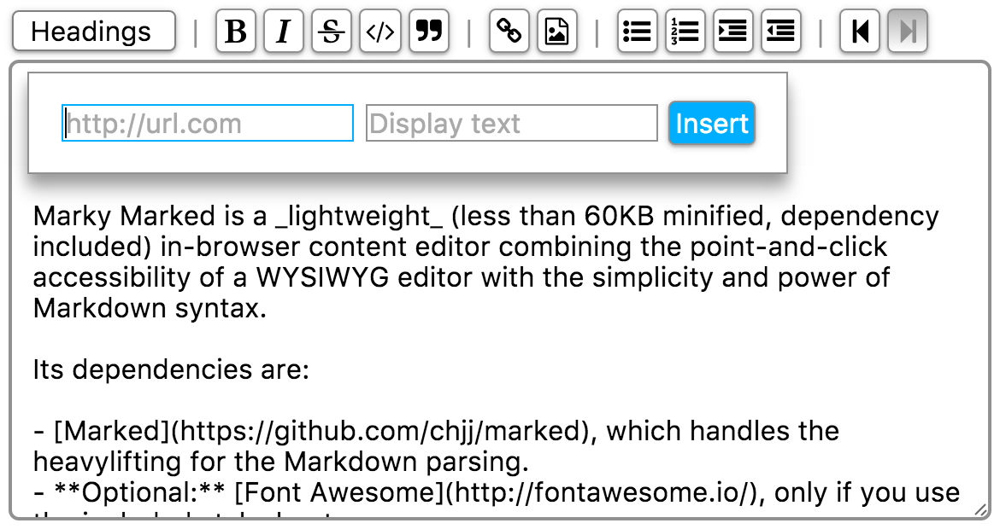
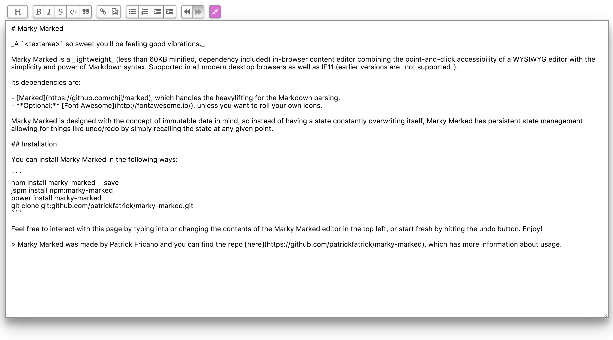

# Marky Marked

_A `<textarea>` so sweet you'll be feeling good vibrations._
[http://patrickfatrick.github.io/marky-marked/](http://patrickfatrick.github.io/marky-marked/)

[](https://circleci.com/gh/patrickfatrick/marky-marked)
[](https://codecov.io/github/patrickfatrick/marky-marked?branch=master)
[](https://www.bithound.io/github/patrickfatrick/marky-marked)
[](https://www.bithound.io/github/patrickfatrick/marky-marked/master/dependencies/npm)
[![MIT License][license-image]][license-url]


## What is it?

Marky Marked is a lightweight in-browser content editor combining Markdown with the typical WYSIWYG toolbar. The end result is an editor that rewards good Markdown usage but also allows a point and click editor for folks who either are new to Markdown, forget a specific formatting guideline, or just prefer using their mouse. Marky Marked's minified file is less than 60KB including dependency.

Because it's all Markdown the markup that comes out of it is well-formatted and easy to parse. One philosophical concern is that no style attributes are ever applied. All Marky Marked outputs is markup. Marky Marked also sanitizes the markup so you don't need to worry about HTML in the input.

On top of all of that because it's built with immutable states Marky Marked comes with undo and redo (but see the caveat in the [undo/redo section](#undoredo) below).

Click the links here to learn more about [Markdown syntax](https://help.github.com/articles/markdown-basics/) and [Github Flavored Markdown](https://help.github.com/articles/github-flavored-markdown/) (which Marky Marked uses).

## Changelog

#### v1.3.4

Resizing is now turned off by default for the textarea in the stylesheet.

#### v1.3

- Fullscreen. Hitting the new fullscreen button in the toolbar will toggle `fullscreen-toggled` classes on the container as well as the editor. With this you can make the Marky Marked editor fill the entire browser window. Of course, the included stylesheet already handles it all for you, if you're using it.
- Link and image insertion now behaves a bit differently. If any text is selected in the editor this text will be autopopulated into the alt text or display text input in the dialog. Additionally, instead of always inserting the Markdown snippet after the selected text, Marky Marked will now replace the selected text with the snippet. Which makes more sense when allowing for the autopopulation.

#### v1.2

- Headings selection is no longer done in a `<select>` element, but is instead a dialog with a `<ul>`. This was done to make the experience easier to style and make it consistent between browsers. 
- The update event has been replaced with the more consistently named "markyupdate" event.
- Some work with accessibility.
- Bug fixes.

## Dependencies & Support

Marky Marked has two dependencies, both of which are included in the /dist files:

- [Marked](https://github.com/chjj/marked), which handles the heavylifting for the Markdown parsing.
- Optional: [Font Awesome](http://fontawesome.io/), unless you want to roll your own icons.

Marky Marked is supported in all modern desktop browsers as well as IE11. In an effort to keep it light, and given that January 2016 effectively marks the end of pre-11 IE, there won't really be much of an effort to make it compliant with earlier versions for the time being.

## Install

```bash
$npm install marky-marked --save
$jspm install npm:marky-marked
$bower install marky-marked
$git clone git:github.com/patrickfatrick/marky-marked.git
```

## Usage

The easiest way to instantiate an editor is to simply add `<marky-mark></marky-mark>` to your markup and then call `marky.mark()`.

```html
<marky-mark></marky-mark>
<script>
	document.addEventListener('DOMContentLoaded', function () {
		marky.mark();
	});
</script>
```

You can also use any element as the container but you'll have to reference the container element in your Javascript.

```html
<mark-wahlberg></mark-wahlberg>

<script>
document.addEventListener('DOMContentLoaded', function () {
	marky.mark(document.getElementsByTagName('mark-wahlberg'));
});
</script>
```

From there Marky Marked should handle the rest. Note that the element you use should be empty. If it has any innerHTML Marky Marked will skip it. This is to ensure you can't initialize the same element more than once.

## Styling

The repo comes with a stylesheet in `/dist` that will get you where you want to go. But you are of course welcome to handle your own styling.

If you do use the stylesheet that comes with, you will need to install [Font Awesome](http://fontawesome.io/) onto your site, or you will be without toolbar icons.

## Undo/Redo

Think of state as a snapshot of the data inside Marky Marked at any given time. Marky Marked stores up to 1000 states, after which it starts clearing out the oldest states as new states are created. So it's not infinite.

The undo/redo buttons advance or go back five steps in the state timeline. So you effectively have 200 user-facing states at any given time that reflect 1000 changes (keep in mind that typing a single character counts as a change).

But if you undo to a previous state and then create a new state by typing or adding a format from the toolbar, the timeline erases those states after the one you went back to. Just like in most any file editor.

## Indent/Outdent

New to v1.1.0 are toolbar buttons for indenting and outdenting. These buttons will add and subtract four spaces to the start of each line selected (or remove all spaces at the start of the line in the case of an outdent on a line starting with fewer than four spaces).

## Inserting Links and Images

New to v1.1.0 is a set of a dialogs for inputs links and images as opposed to simply inserting a generic Markdown snippet. Now you are greeted with a basic dialog in which you can put in the URL and optionally the display text or alt text, depending on which button is clicked.



As of v1.3.0, if any text is selected in the editor the 'Display text' or 'Alt text' input in the dialog will be autopopulated with that text when calling the dialog. Upon inserting the link or image snippet, that selected text will be replaced with the snippet.

## Fullscreen

New to v1.3.0 is the ability to use fullscreen. This is accomplished by toggling `fullscreen-toggled` on the container and the editor (as well as the button itself), when the new fullscreen button is hit.

The included stylesheet handles the CSS changes already, but something like this should work, if you're not using the stylesheet.

```css
[id^="editor-"].fullscreen-toggled {
  width: 100%;
  height: 100%;
  position: fixed;
  top: 0;
  left: 0;
  padding: 1rem;
  box-sizing: border-box;
  background: $white;
  z-index: 1000;
}
.marky-editor.fullscreen-toggled {
  width: 100%;
  height: 90%;
  box-shadow: rgba(0, 0, 0, 0.3) 0 19px 60px, rgba(0, 0, 0, 0.22) 0 15px 20px;
}
button.fullscreen.fullscreen-toggled {
	/* some styles to show the setting is toggled */
}
```

This is what I use in the demo site.



## API

#### Accessing Markdown and HTML

At any given time in the state of the editor you can access both the markdown and the HTML by accessing the editor's `_marky` property.

```javascript
var _marky = document.querySelector('.marky-editor.editor-0')._marky;
var index = _marky.index;
var markdown = _marky.state[index].markdown;
var html = _marky.state[index].html;
```

Since state is immutable you can also grab the markdown or HTML at any point in recent history by changing the index.


#### Events

You can watch for a number of events from the `marky-editor` element.

```javascript
var editor = document.querySelector('.marky-editor.editor-0');
editor.addEventListener('markychange', function (e) {
	// Do stuff;
});
```

Here's the list of possibilities


```javascript
markyupdate // Emitted when any forward-progress change happens to the state (not including undo/redo).
markychange // Emitted when any change happens to the state (including undo/redo).
markyfocus // Emitted whenever the editor gains focus.
markyblur // Emitted whenever the editor loses focus.
markyselect // Emitted whenever the text selection in the editor changes.
```

#### Formatting

The various toolbar controls are exposed for easy use, and with the exception of the heading method all follow the same guidelines and return the same thing.

```javascript
var editor = document.querySelector('.marky-editor');
editor._marky.bold([0, 5]); // Takes an array of the starting and ending indices to apply the format to
editor._marky.bold(); // If no argument is passed the currently selected text is assumed
```

This will return the newly selected text after the formatting has been applied.

For the heading method you should also pass in the level of heading, 1 to toggle an `h1`, 2 for `h2`, etc.

```javascript
editor._marky.heading(1, [0, 5]); // Also takes an array for the text to apply the format to
editor._marky.heading(4); // If no second argument is passed the currently selected text is assumed
editor._marky.heading(); // Assumes 0, which removes all headings from the selected text
```

Again an array representing the new starting and ending position is returned.

New to v1.1.0 you can now programmatically insert link and image snippets like so,

```javascript
editor._marky.link([0, 0], 'http://github.com/patrickfatrick/marky-marked', 'Marky Marked');
editor._marky.image([0, 0], 'http://i.imgur.com/VlVsP.gif', 'Chuck Chardonnay');
```

As before the first argument is an array representing the selection to use. The second is the URL to the link or the image. The third argument is the display text in the case of `link()` and the alt text in the case of `image()`. This method returns the new selection.

The full list of formatting methods is

```javascript
heading()
bold()
italic()
strikethrough()
code()
blockquote()
link()
image()
unorderedList()
orderedList()
indent()
outdent()
```

**NOTE:** These methods behave exactly like the toolbar buttons. They do not always apply the formatting and instead act more like toggles, with the exception of `link()` and `image()` which always insert the relevant Markdown snippet.

#### Undo/Redo

You can manually undo and redo like so, optionally passing in the number of states to undo or redo by as an argument. If no argument is passed Marky Marked will default to 5 as if the button was pushed.

```javascript
editor._marky.undo(20);
editor._marky.redo(13);
```

The new state index will be returned.

#### Setting the selection

You can set the text selection in the editor like so, passing in an array for the start and end positions. If no argument is passed Marky Marked will default to [0, 0];

```javascript
editor._marky.setSelection([5, 7]);
```

This method returns the array that was passed in.

#### Expanding the selection

You can expand the current text selection forward or backward in the editor like so, passing in the number of characters to move. If no argument is passed Marky Marked will default to 0;

```javascript
editor._marky.expandSelectionForward(3);
editor._marky.expandSelectionBackward(20);
```

This method returns the new starting and ending positions for the selection as an array.

#### Moving the cursor

You can also move the cursor in the editor like so, passing in the number of characters to move. If no argument is passed Marky Marked will default to 0.

```javascript
editor._marky.moveCursorForward(3);
editor._marky.moveCursorBackward(20);
```

This method returns the new cursor position in the editor.

## Building & Testing

Marky Marked uses a combination of Karma, Mocha, Chai, and Istanbul for tests. To run the tests,

```bash
$npm install
$npm test
```

You may need to install the karma and its plugins globally if you don't already have them. You can also test in other browsers by adding them to karma.conf.js. Chrome, Firefox, and Safari launchers are plugged but not included in the list of browsers by default.

To run ESLint and build the distribution files:

```bash
$gulp
```

To build the stylesheet:

```bash
$gulp styles
```

## What's the plan?

- Ability to customize instances, particularly with some or all of marked's options.
- Possible updates to undoing and redoing state by prioritizing formatting changes over user input (the idea being to always undo or redo to any toolbar action, overriding the index provided in the undo/redo methods). This would be an option as well.

## License

Marky Marked is freely distributable under the terms of the [MIT license](./LICENSE).

[license-image]: http://img.shields.io/badge/license-MIT-blue.svg?style=flat
[license-url]: LICENSE


_Each Marky Marked release is linted with ESLint and tested with a combination of Karma, Mocha, Chai, and Istanbul._
