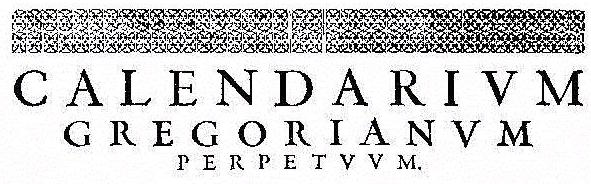
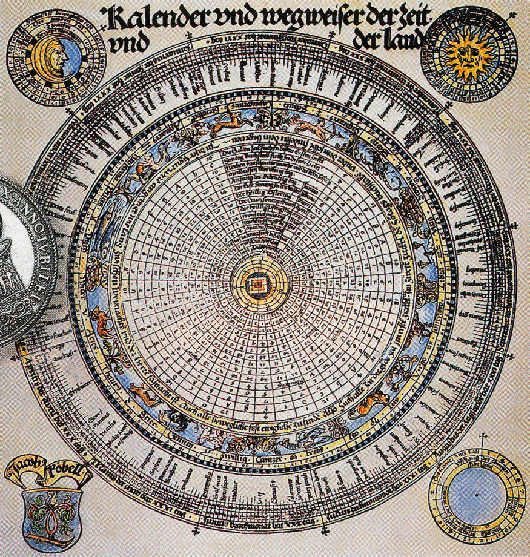

#Gregorian
_A Javascript micro library for converting and displaying dates._

[](https://travis-ci.org/patrickfatrick/gregorian)
[](https://david-dm.org/patrickfatrick/gregorian)
[](https://david-dm.org/patrickfatrick/gregorian#info=devDependencies)
[](https://coveralls.io/github/patrickfatrick/gregorian?branch=master)
[![MIT License][license-image]][license-url]



>reform |riˈfôrm|  
>verb [ with obj. ]  
>_1 make changes in (something, typically a social, political, or economic institution or practice) in order to improve it: an opportunity to reform and restructure an antiquated schooling model._

Gregorian is named after the calendar introduced in 1582 by under Pope Gregory XIII's papacy, the calendar we currently use today. It was a **reform** of the Julian calendar to make the year 0.002% shorter and also slightly changed the leap year schedule to omit 3 leap days every 400 years.

##What does it do?
Gregorian is a wrapper for the native Javascript `Date` object that allows you to customize how to display and write dates pretty minutely. It also allows you to do some basic date manipulation (See section 'Manipulation' below). It has no dependencies and can be run either in the browser as a global or as a module. Each release is linted with ESLint and tested with Mocha Chai to minimize errors.

You can take the same date object and express it like:

```javascript
'April 11, 1988'
'1988-04-11'
'4/11/88'
'Monday, 11 Apr 1988 12:00:00.000AM UTC 0:00'
'Monday'
'Mon, April 11'
'1988-04-11T00:00:00.000Z' // ISO string
'Mon, 11 Apr 1988 00:00:00 GMT' // UTC string
576720000000 // UNIX time
and more!
```

##What doesn't it do?
This does not accept native language input. For instance `gregorian.reform('next Tuesday')` will throw a TypeError.

It accepts anything Javascript natively accepts when creating a date object. `gregorian.reform('April 11, 1988 00:00 UTC')` is valid as is `gregorian.reform('04/11/1988')` is as valid as `gregorian.reform(new Date('04/11/1988'))` is as valid as `gregorian.reform(576741600000)`.

The library is currently in English only.

##Install

```bash
npm install gregorian --save
jspm install npm:gregorian
bower install gregorian
git clone git@github.com:patrickfatrick/gregorian.git
```

You can install it into your site using `<script src="./gregorian/dist/gregorian.min.js"></script>` as usual, or you can include it as a module using `require('./node_modules/gregorian')` or `import gregorian from 'gregorian'`, etc., with your favorite module loader.

To run the tests, `npm test`.

##Usage
To create a gregorian object, call `gregorian.reform()` with either a date object or a date-string. For instance 

```javascript
gregorian.reform('2015-10-31')
gregorian.reform(new Date()) // Current date and time
gregorian.reform() // Current date and time
```

But that's kind of boring. To do stuff with it, chain a `.to()` method to it, passing a string for the format you'd like to use. For instance `gregorian.reform('2015-10-31').to('unix')` or `gregorian.reform('2015-10-31').to('iso')`. This will return the converted string or else the number of milliseconds passed since January 1, 1970 in the case of `'unix'`.

###Accepted formats
The following are plug-n-play formats that are simply wrappers for existing Javascript Date methods and should not be used with any other formats. The `-short` methods extend the existing methods by removing the time from the output.

```javascript
'unix'
'utc'
'utc-short'
'iso'
'iso-short'
```

The following are components you can use to construct a format string like `'mm/dd/yyyy'` or `'DD, MM yyyy-mm-dd hh:tt.ll+ap zz'`. 

```javascript
'yyyy' // four-digit year (2015)
'yy' // two-digit year (15)
'DD' // full day of the week (Sunday-Saturday)
'D' // abbreviated day of the week (Sun-Sat)
'dd' // two-digit date of the month (01-31)
'd' // date of the month with no leading zeros (1-31)
'dt' // date of the month with no leading zeros but with the ordinal (1st-31st)
'MM' // full month (January-December)
'M' // abbreviated month (Jan-Dec)
'mm' // two-digit month (01-12)
'm' // month with no leading zeros (1-12)
'hh' // two-digit hours (00-12)
'h' // hour with no leading zeros (0-12)
'HH' // two-digit 24-hour clock hours (00-23)
'H' // 24-hour clock hour with no leading zeros (0-23)
'tt' // two-digit minutes (00-59)
't' // minutes with no leading zeros (0-59)
'AP' // uppercase 12-hour clock period (AM or PM)
'ap', // lowercase 12-hour clock period (am or pm)
'ss' // two-digit seconds (00-59)
's' // seconds with no leading zeros (0-59)
'll' // milliseconds (000-999)
'l' // milliseconds with no leading zeros (0-999)
'zz' // timezone offset from UTC (UTC -6:00)
```
**NOTE:** Any format strings directly touching each other should be separated with a `'+'` or else with an optional punctuation delimiter. This delimiter will be removed from the final string.

Some examples:

```javascript
gregorian.reform('09/25/2015 00:00 UTC -06:00').to('DD, yyyy-m-d hh:tt.ll+ap zz') // 'Friday, 2015-9-25 12:00.000am UTC -6:00'
gregorian.reform('09/25/2015 UTC -06:00').to('D, yy-mm-dd h:t.l#AP zz', '#') // 'Fri, 15-09-25 12:0.0AM UTC -6:00'
gregorian.reform('09/25/2015 UTC -06:00').to('DD, MM yyyy-m-d hh:tt.ll+ap zz') // 'Friday, September 2015-9-25 12:00.000am UTC -6:00'
gregorian.reform('09/25/2015 UTC -06:00').to('DD, M yyyy-m-d hh:tt.ll?ap zz', '?') // 'Friday, Sept 2015-9-25 12:00.000am UTC -6:00'
gregorian.reform('09/25/2015 23:59 UTC').to('DD, M yyyy-m-d H:tt:s.ll zz') // 'Friday, Sept 2015-9-25 17:59:0.000 UTC -6:00'
gregorian.reform('09/25/2015 01:00 UTC').to('DD, M yyyy-m-d H:tt:ss.ll zz') // 'Thursday, Sept 2015-9-24 19:00:00.000 UTC -6:00'
```

**NOTE:** Due to how RegEx handles underscores we will need to get a little crazier with the delimiting if you want to output underscores in your formatted date string.

```javascript
gregorian.reform('09/25/2015 UTC -06:00').to('D#_#yy#_#mm#_#dd#_#h:t.l#AP#_#zz', '#') // 'Fri_15_09_25_12:0.0AM_UTC -6:00'
```

##Manipulation
###Adding and subtracting
You can manipulate the gregorian object like 

```javascript
gregorian.reform('2015-10-31').add(5, 'd') // 2015-11-05
gregorian.reform('2015-10-31').subtract(7, 'm') // 2015-03-31
```

This will return a new gregorian object that can then be formatted into a string as usual `gregorian.reform('2015-10-31').subtract(1, 'm').to('iso')`

Accepted increments you can use for additions and subtractions are

```javascript
'l' // 1 millisecond
's' // 1 second
't' // 1 minute
'h' // 1 hour
'd' // 1 day
'w' // 1 week
'm' // 1 month (position will be on the same date and time of the month)
'y' // 1 year (position will be on the date and time of the year)
```
###Restart
You can set the date or time to the start of the increment specified in local time. For instance,

```javascript
gregorian.reform('April 11, 1988 8:23:15.123').restart('s') // '1988-04-11 08:23:15'
gregorian.reform('April 11, 1988 8:23:15.123').restart('t') // '1988-04-11 08:23:00'
gregorian.reform('April 11, 1988 8:23:15.123').restart('h') // '1988-04-11 08:00:00'
gregorian.reform('April 11, 1988 8:23:15.123').restart('d') // '1988-04-11 00:00:00'
gregorian.reform('April 11, 1988 8:23:15.123').restart('w') // '1988-04-10 00:00:00'
gregorian.reform('April 11, 1988 8:23:15.123').restart('m') // '1988-04-01 00:00:00'
gregorian.reform('April 11, 1988 8:23:15.123').restart('y') // '1988-01-01 00:00:00'
```

Note that the `restart` functions return times in the local time zone. You would see a two-hour difference running these same functions in Eastern vs Mountain time.

###Reagent
As of v1.3 gregorian no longer throws a TypeError when constructing an object with an invalid date. Instead, gregorian now has a method `reagent()` which outputs `true` or `false` depending on the validity of the date it contains. Use this to check the dates that are passed through.

```javascript
reform().reagent() // true
reform('next Tuesday').reagent() // false
```

###Recite
New to v1.3, `recite()` will simply return the date object that the gregorian object has at that point.

```javascript
reform('04/11/1988 00:00 UTC').add(1, 'd').recite() // 1988-04-12T00:00:00.000Z
reform('October 15, 2015 00:00 UTC').add(1, 'y').subtract(5, 'd').subtract(5, 't').restart('h').recite() // 2016-10-09T23:00:00.000Z
```

###With Date.JS
You can combine Gregorian with [Date.JS](http://matthewmueller.github.io/date/) to allow for human-readable date input. `gregorian.reform(date('next Tuesday'))` is valid. But do keep in mind that Date.JS is pretty forgiving. `gregorian.reform(date('not a date'))` is also valid and will return a gregorian object for the current date and time. Meanwhile `gregorian.reform(date('next Tuesday'))` will also return the current date and time if the function is run on Tuesday.

##Why not use MomentJS?
[Moment](http://momentjs.com/) is awesome and I personally use it in a lot of projects. This is not intended to replace Moment by any means, it's simply intended to provide a more focused set of features at a fraction of the weight. Moment's minified .js file is about 5x the size of Gregorian's.

## License

Gregorian is freely distributable under the terms of the [MIT license](./LICENSE).

[license-image]: http://img.shields.io/badge/license-MIT-blue.svg?style=flat
[license-url]: LICENSE

##What's the plan?

- Add setter functions to take an existing gregorian object and set a specific date or time on it.
- Add ability to make a translation with a config, as well as direct translations for some common languages.
- Add more testing.

_Each Gregorian release is linted with ESLint and tested with Mocha Chai._


