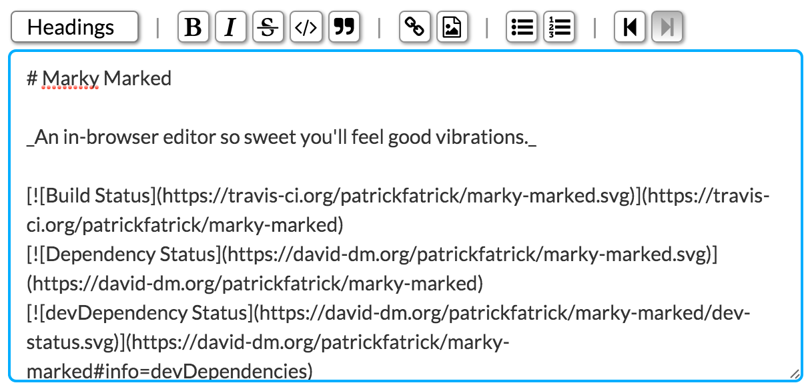

# Marky Marked

_An in-browser editor so sweet you'll be feeling good vibrations._ [http://patrickfatrick.github.io/marky-marked/](http://patrickfatrick.github.io/marky-marked/)

[](https://travis-ci.org/patrickfatrick/marky-marked)
[](https://david-dm.org/patrickfatrick/marky-marked)
[](https://david-dm.org/patrickfatrick/marky-marked#info=devDependencies)
[](https://coveralls.io/github/patrickfatrick/marky-marked?branch=master)
[![MIT License][license-image]][license-url]



## What is it?

Marky Marked is an in-browser editor combining Markdown with the typical WYSIWYG toolbar. The end result is an editor that rewards good Markdown usage but also allows a point and click editor for folks who either are new to Markdown, forget a specific formatting guideline, or just prefer using their mouse. It's very much based on some of the ideas in Basecamp's excellent [Trix](http://trix-editor.org/) editor, but with more of a Markdown flavor.

Because it's all Markdown the markup that comes out of it is well-formatted and easier to parse in the editor than a lot of WYSIWYGs which sometimes sometimes create messy markup. One philosophical concern is that no style attributes are ever applied. All Marky Marked outputs is markup.

On top of all of that because it's built with immutable states Marky Marked comes with undo and redo.

## Dependencies

Marky Marked has two dependencies to run, both of which are included in the /dist files:

- [Immutable.js](https://facebook.github.io/immutable-js/)
- [Marked](https://github.com/chjj/marked)

- Optional dependency: [Font Awesome](http://fontawesome.io/), only if you use the included stylesheet.

Immutable.js handles the immutable state powering the undo/redo functionality. Meanwhile Marked is doing the heavylifting for the Markdown processing.

## Install

```bash
npm install marky-mark --save
jspm install npm:marky-mark
bower install marky-mark
git clone git:github.com/patrickfatrick/marky-mark.git
```

## Usage

The easiest way to instantiate an editor is to simply add `<marky-mark></marky-mark>` to your markup and then call `marky.mark()`.

```html
<marky-mark></marky-mark>
<script>
	document.addEventListener('DOMContentLoaded', function () {
		marky.mark();
	});
</script>
```

You can also use any element as the container but you'll have to do the initialization in your Javascript.

```html
<mark-wahlberg></mark-wahlberg>

<script>
document.addEventListener('DOMContentLoaded', function () {
	marky.mark(document.getElementsByTagName('mark-wahlberg'));
});
</script>
```

From there Marky Marked should handle the rest.

## Styling

The repo comes with a stylesheet in /dist that will get you where you want to go. But you are of course welcome to handle your own styling.

If you do use the stylesheet that comes with, you will need to install [Font Awesome](http://fontawesome.io/) onto your site, or you will be without toolbar icons.

## API

At any given time in the state of the editor you can access both the markdown and the HTML by accessing the editor's `_marky` property.

```javascript
var _marky = document.querySelector('.marky-editor.editor-0')._marky;
var index = _marky.index;
var markdown = _marky.state.get(index).get('markdown');
var html = _marky.state.get(index).get('html');
```

You'll notice the immutable `get()` syntax here. Since state is immutable you can also grab the markdown or HTML at any point in recent history by changing the index.

You can listen to update events like so:

```javascript
var editor = document.querySelector('.marky-editor.editor-0');
editor.addEventListener('markychange', function (e) {
	// Do stuff;
});
```
## Undo/Redo

Think of state as a snapshot of the data inside Marky Marked at any given time. Marky Marked stores up to 500 states, after which it starts clearing out the oldest states as states are created. So it's not infinite.

The undo/redo buttons advance or go back five steps in the state timeline. So you effectively have 100 user-facing states at any given time that reflect 500 changes (keep in mind that typing a single character counts as a change).

But if you undo to a previous state and then create a new state by typing or adding a format from the toolbar, the timeline erases those states after the one you went back to. Just like in most any file editor.

## What's the plan?

- More annotations.
- Make a github page to host a demo.
- Add more JSDOM and/or browser-based testing.
- Explore a nicer modal-based link and url entry.
- Explore detection so you can have visual cues in the toolbar of what formats are applied where the cursor is.

## License

Marky Marked is freely distributable under the terms of the [MIT license](./LICENSE).

[license-image]: http://img.shields.io/badge/license-MIT-blue.svg?style=flat
[license-url]: LICENSE


_Each Marky Marked release is linted with ESLint and tested with Mocha Chai._
